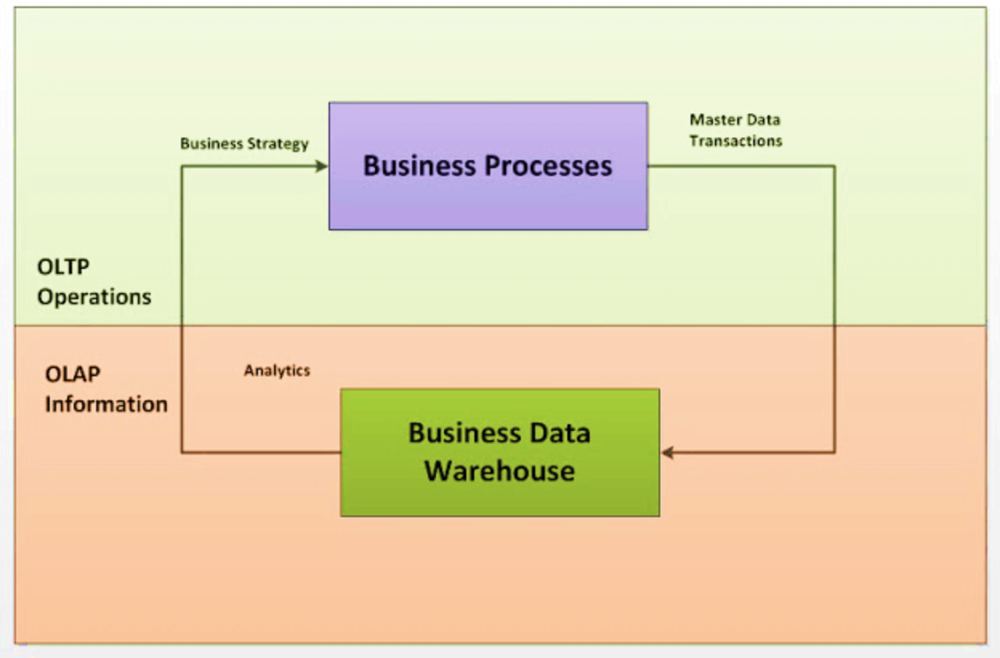

# PostgreSQL

### PostgreSQL解决方案

​	PostgreSQL:  OLTP

​	Greenplum:  MPPDB（shared-nothing） for OLAP

​	pgxc, pgxl:   PG的集群

​	pgpool II:     PG的读写分离实现

​	PG 流复制:  PG的高可用实现

​    PG备份： pg_dump/pg_dumpall (pg_restore)

​    PG数据同步：全量备份后，进行wal日志的SQL分析，然后通过重演SQL进行增量同步。

​                             pg_basebackup + PG流复制进行增量同步

### 数据库理论基础

#### 1 高可用（High-Availability）

##### 定义和衡量指标

**高可用性（High Availability）通常来描述一个系统，经过专门的设计，从而减少停工时间，而保持其服务的高度可用性。**

**可用性衡量指标**：%availability =（Total Elapsed Time－Sum of Inoperative Times）/ Total Elapsed Time

假设系统一直能够提供服务，那么系统的可用性是100%；很多企业的高可用目标是4个9（即99.99%），这就意味着系统的年停机时间为0.876个小时。

##### 通过冗余实现高可用

在UNIX系统上创建高可用性计算机系统，业界的通行做法也是很有效的做法，就是采用集群系统（Cluster），将各个[主机系统](https://baike.baidu.com/item/主机系统)通过网络或其他手段有机地组成一个群体，共同对外提供服务。**创建群集系统，通过实现高可用性的软件将[冗余](https://baike.baidu.com/item/冗余)的高可用性的硬件组件和[软件组件](https://baike.baidu.com/item/软件组件)组合起来，消除[单点故障](https://baike.baidu.com/item/单点故障)（***包括消除供电、磁盘、SPU（System Process Unit）、网络、软件的单点故障，尽量消除单系统运行时的单点故障*）。组合系统所需的软硬件组成越多，保证高可用的难度就越大。

所以，实现高可用的本质就是通过冗余和高效的故障转移来避免单点故障。在数据库分布式层面，就是冗余部署数据库服务，当单点数据库服务出现故障后，及时发现并用备用数据库服务替换。

##### 工作方式

- 主从方式 （非对称方式）工作原理：主机工作，备机处于监控准备状况；当主机宕机时，备机接管主机的一切工作，待主机恢复正常后，按使用者的设定以自动或手动方式将服务切换到主机上运行，数据的一致性通过共享[存储系统](https://baike.baidu.com/item/存储系统)解决。

- 双机双工方式（互备互援）工作原理：两台主机同时运行各自的服务工作且相互监测情况，当任一台主机宕机时，另一台主机立即接管它的一切工作，保证工作实时，应用服务系统的关键数据存放在共享存储系统中。

- [集群](https://baike.baidu.com/item/集群)工作方式（多服务器互备方式）工作原理：多台主机一起工作，各自运行一个或几个服务，各为服务定义一个或多个备用主机，当某个主机故障时，运行在其上的服务就可以被其它主机接管。

  

#### 2 故障转移（Fail-over）

**故障转移（Fail-over），即当活动的服务或应用意外终止时，快速启用冗余或备用的服务器、系统、硬件或者网络接替它们工作。** 故障转移与交换转移操作基本相同，只是**故障转移通常是自动完成的**，没有警告提醒手动完成，而交换转移需要手动进行。

#### 3 负载均衡（Load Balance）

**负载均衡（Load Balance）是指将负载（工作任务）进行平衡、分摊到多个操作单元上进行运行**（例如FTP服务器、Web服务器、企业核心应用服务器和其它主要任务服务器等）**，从而协同完成工作任务。**

负载均衡是构建在原有网络结构之上，它提供了一种透明且廉价有效的方法扩展服务器和网络设备的带宽、加强网络数据处理能力、增加吞吐量、提高网络的可用性和灵活性。

> 实现数据库的负载均衡技术，首先要有一个可以控制连接数据库的控制端。在这里，它截断了数据库和程序的直接连接，由所有的程序来访问这个中间层，然后再由中间层来访问数据库。这样，我们就可以控制具体访问某个数据库了，然后还可以根据数据库的当前负载采取有效的均衡策略，来调整每次连接到哪个数据库。

#### 4 读写分离

#### 5 集群、分布式、MPP、MPPDB

**集群：就是逻辑上处理同一业务的多台机器的集合。**（同一个业务，通过部署在多个服务器上处理。）

集群系统中的单个计算机通常称为节点，通常通过局域网连接，但也有其它的可能连接方式。集群计算机通常用来改进单个计算机的计算**速度和/或可靠性**。一般情况下集群计算机比单个计算机，比如工作站或超级计算机性价比要高得多。

比如单个重负载的运算分担到多台节点设备上做并行处理，每个节点设备处理结束后，将结果汇总，返回给用户，系统处理能力得到大幅度提高。一般分为几种：

- 高可用性集群：一般是指当集群中有某个节点失效的情况下，其上的任务会自动转移到其他正常的节点上。还指可以将集群中的某节点进行离线维护再上线，该过程并不影响整个集群的运行。

- 负载均衡集群：负载均衡集群运行时，一般通过一个或者多个前端负载均衡器，将工作负载分发到后端的一组服务器上，从而达到整个系统的高性能和高可用性。

- 高性能计算集群：高性能计算集群采用将计算任务分配到集群的不同计算节点而提高计算能力，因而主要应用在科学计算领域。

  

**分布式：一个业务分拆成多个子业务或者本身就是不同的业务，部署在不同的服务器上。**

简单说，分布式是以缩短单个任务的执行时间来提升效率的，而集群则是通过提高单位时间内执行的任务数来提升效率。

举例：就比如新浪网，访问的人多了，他可以做一个群集，前面放一个均衡服务器，后面几台服务器完成同一业务，如果有业务访问的时候，响应服务器看哪台服务器的负载不是很重，就将给哪一台去完成，并且一台服务器垮了，其它的服务器可以顶上来。分布式的每一个节点，都完成不同的业务，一个节点垮了，那这个业务可能就失败了。

**MPP (Massively Parallel Processing)**: 即大规模并行处理，在数据库非共享集群中，每个节点都有独立的磁盘存储系统和内存系统，业务数据根据数据库模型和应用特点划分到各个节点上，每台数据节点通过专用网络或者商业通用网络互相连接，彼此协同计算，作为整体提供数据库服务。非共享数据库集群有完全的可伸缩性、高可用、高性能、优秀的性价比、资源共享等优势。

**MPP是将任务并行的分散到多个服务器和节点上，在每个节点上计算完成后，将各自部分的结果汇总在一起得到最终的结果**(与Hadoop相似)。(详情参考[原文](https://blog.csdn.net/qq_42189083/article/details/80610092))

**MPPDB**：是一款 **Shared Nothing** 架构的**分布式**并行结构化数据库集群，具备高性能、高可用、高扩展特性，可以为超大规模数据管理提供高性价比的通用计算平台，并广泛地用于支撑各类数据仓库系统、BI 系统和决策支持系统。

##### 6 OLAP与OLTP

**定义：**

OLAP 称作**联机分析处理（Online Analytical Processing）**。

OLTP 称作**叫联机事务处理（Online Transaction Processing）** 。

**关系：**OLTP 是 OLAP 系统的数据源。

**区别：**OLAP与OLTP之间的主要区别在于：OLAP是用于决策的在线分析和数据检索过程，而OLTP是用于控制基本业务任务的在线交易系统。

[OLTP VS OLAP](https://www.guru99.com/oltp-vs-olap.html)

| **Parameters**         | **OLTP**                                                     | **OLAP**                                                     |
| ---------------------- | ------------------------------------------------------------ | ------------------------------------------------------------ |
| **Process**            | It is an online transactional system. It manages database modification. | OLAP is an online analysis and data retrieving process.      |
| **Characteristic**     | It is characterized by large numbers of short online transactions. | It is characterized by a large volume of data.               |
| **Functionality**      | OLTP is an online database modifying system.                 | OLAP is an online database query management system.          |
| **Method**             | OLTP uses traditional DBMS.                                  | OLAP uses the data warehouse.                                |
| **Query**              | Insert, Update, and Delete information from the database.    | Mostly select operations                                     |
| **Table**              | Tables in OLTP database are normalized.                      | Tables in OLAP database are **not** normalized.              |
| **Source**             | OLTP and its transactions are the sources of data.           | Different OLTP databases become the source of data for OLAP. |
| **Data Integrity**     | OLTP database must maintain data integrity constraint.       | OLAP database does not get frequently modified. Hence, data integrity is not an issue. |
| **Response time**      | It's response time is in millisecond.                        | Response time in seconds to minutes.                         |
| **Data quality**       | The data in the OLTP database is always detailed and organized. | The data in OLAP process might not be organized.             |
| **Usefulness**         | It helps to control and run fundamental business tasks.      | It helps with planning, problem-solving, and decision support. |
| **Operation**          | Allow read/write operations.                                 | Only read and rarely write.                                  |
| **Audience**           | It is a market orientated process.                           | It is a customer orientated process.                         |
| **Query Type**         | Queries in this process are standardized and simple.         | Complex queries involving aggregations.                      |
| **Back-up**            | Complete backup of the data combined with incremental backups. | OLAP only need a backup from time to time. Backup is not important compared to OLTP |
| **Design**             | DB design is application oriented. Example: Database design changes with industry like Retail, Airline, Banking, etc. | DB design is subject oriented. Example: Database design changes with subjects like sales, marketing, purchasing, etc. |
| **User type**          | It is used by Data critical users like clerk, DBA & Data Base professionals. | Used by Data knowledge users like workers, managers, and CEO. |
| **Purpose**            | Designed for real time business operations.                  | Designed for analysis of business measures by category and attributes. |
| **Performance metric** | Transaction throughput is the performance metric             | Query throughput is the performance metric.                  |
| **Number of users**    | This kind of Database users allows thousands of users.       | This kind of Database allows only hundreds of users.         |
| **Productivity**       | It helps to Increase user's self-service and productivity    | Help to Increase productivity of the business analysts.      |
| **Challenge**          | Data Warehouses historically have been a development project which may prove costly to build. | An OLAP cube is not an open SQL server data warehouse. Therefore, technical knowledge and experience is essential to manage the OLAP server. |
| **Process**            | It provides fast result for daily used data.                 | It ensures that response to the query is quicker consistently. |
| **Characteristic**     | It is easy to create and maintain.                           | It lets the user create a view with the help of a spreadsheet. |
| **Style**              | OLTP is designed to have fast response time, low data redundancy and is normalized. | A data warehouse is created uniquely so that it can integrate different data sources for building a consolidated database |

