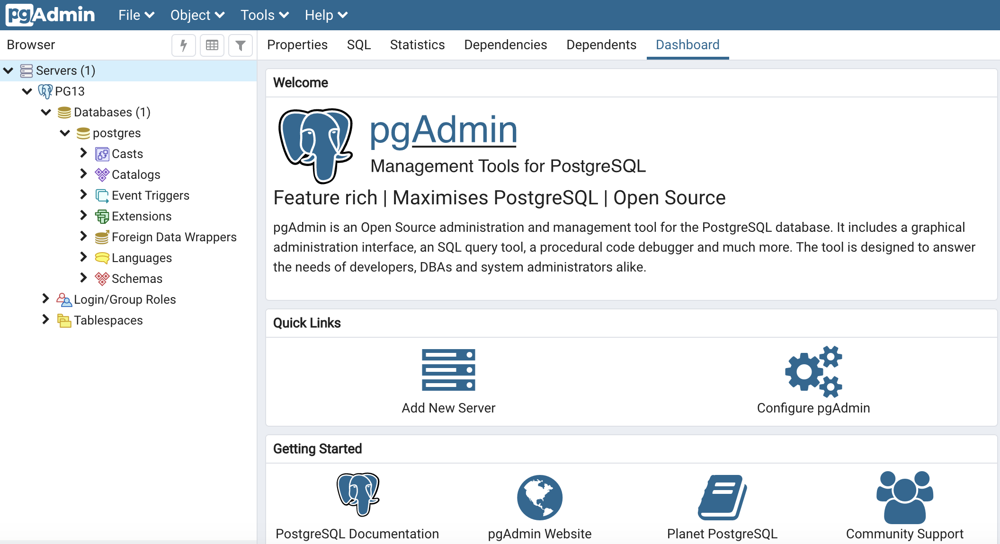

# PostgreSQL数据库可视化

## PostgreSQL监控平台

#### PostgreSQL监控平台-TOP

Grafana 

Netdata 

Zabbix 

## PostgreSQL管理平台

#### PostgreSQL管理平台-特性图谱

#### PostgreSQL管理平台-TOP4

##### [pgAdmin4](https://www.pgadmin.org) - PostgreSQL社区标配管理工具

是PostgreSQL社区提供的管理工具，是早期pgAdmin的完整重写；python后端，bootstrap前端，支持桌面运行和web浏览器运行；支持多种风格，界面友好；具备常规功能。

遵循[PostgreSQL License](https://www.pgadmin.org/licence/)。

##### [DBeaver](https://dbeaver.io/) - 开源数据库管理工具中的王者

基于java eclipse rcp技术开发，跨平台性较好（跨平台的瓶颈在于IBM swt）；插件式开发，支持PostgreSQL在内的几乎所有数据库系统；C/S架构，仅支持桌面运行；eclipse风格的客户端，支持浅色和黑色风格，界面规整。

自2015年推出，社区保持活跃，开发迭代保持两周更新一个小版本。

也有商业发行版，但功能差别不大。

遵循[Apache License 2.0](https://github.com/dbeaver/dbeaver/blob/devel/LICENSE.md)。

##### [Navicat](https://www.navicat.com.cn/products/) - 设计完善的模范

支持多种数据库，功能丰富，GUI设计直观、易用、完善（网传c/c++编写）。

商业闭源。（其公司成立于1999年）

##### [JETBrains DataGrip](https://www.jetbrains.com/datagrip/) - 有着JETBrains系列一贯的炫酷

支持多种数据库，功能丰富，GUI设计炫酷。（网传JETBrains系列均为Java + Java swing开发，但预计花费多年时间重写界面。）

商业闭源。（其公司成立于2000年）

