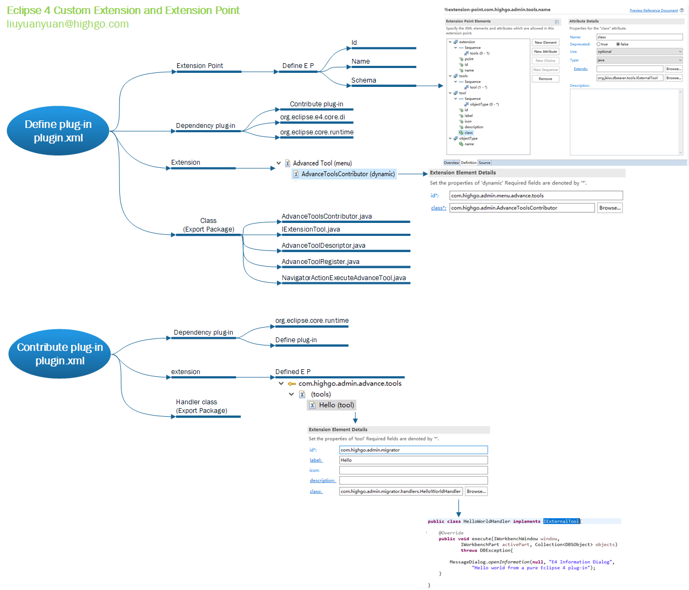

# DBeaver - 开源数据库桌面管理之王

### 简介

[DBeaver](https://link.zhihu.com/?target=https%3A//dbeaver.com/)是一款通用数据库管理工具，跨平台（基于eclipse rcp）适用于开发人员、SQL程序员、数据库管理员和分析人员。支持所有流行的数据库：MySQL，PostgreSQL，SQLite，Oracle，DB2，SQL Server，Sybase，MS Access，Teradata，Firebird，Hive，Presto等。

[DBeaver](https://link.zhihu.com/?target=https%3A//dbeaver.com/)有[开源免费的社区版本](https://link.zhihu.com/?target=https%3A//github.com/dbeaver/dbeaver)，也有收费的商业版本，以下内容均基于社区版本。目前社区版本更新非常活跃，基本每两周会有一次小版本更新。

### 特性图谱：

（待续）

### DBeaver v4.2.5 源码结构图

### 多数据库管理的源码实现-扩展点

